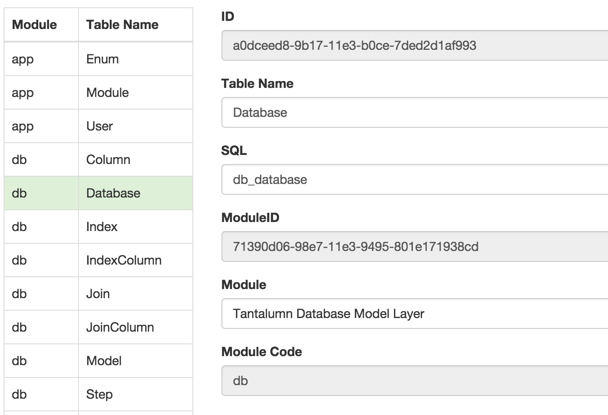
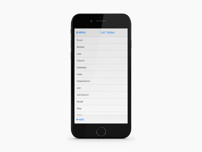
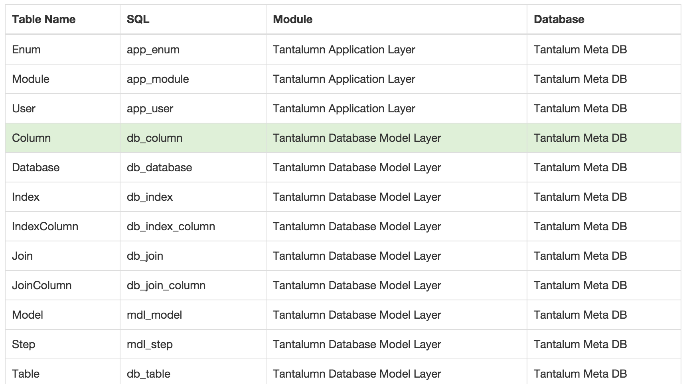
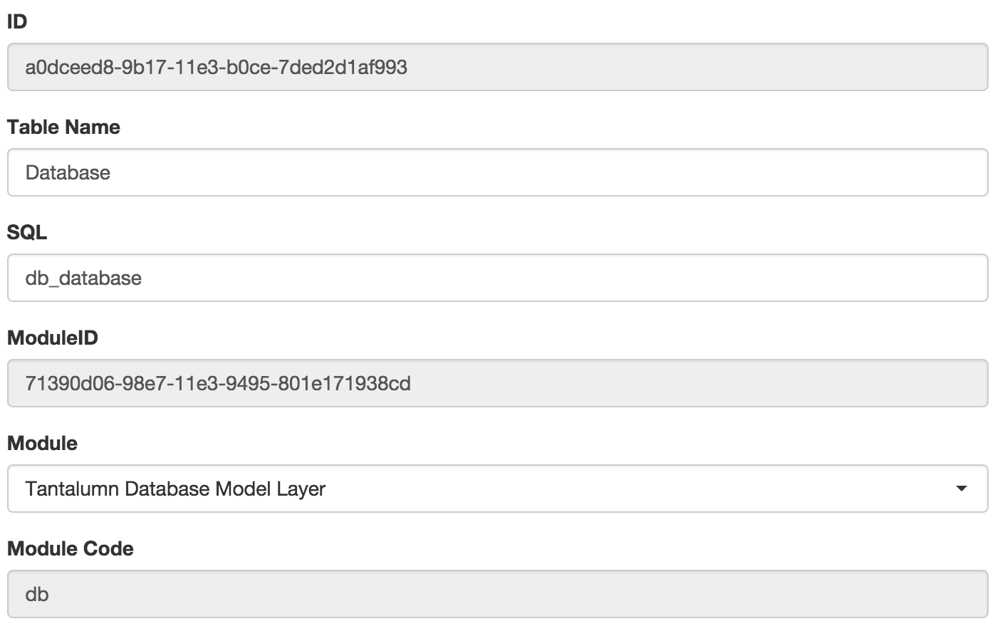

# Page Layer

Rich functionality, custom scripts, and business logic

## Page Definition

```json
{
    "id": "SamplePage",
    "title": "Build Table",
    "viewMode": "single",
    "modelName": "TableColumns",
    "parentModel": "BuildTable",
    "depth": 1,
    "multiPage": true,
    "breadcrumb": [ARRAY_OF_BREADCRUMBS]
        {
            "pageID": "BuildTable",
            "modelName": "ManageTables",
            "field": "TableName"
        }
    ],
    "orderBy": "TableColumnDisplayOrder",
    "splitFields": [ARRAY_OF_FIELDS],
    "quickView": [ARRAY_OF_FIELDS],
    "listFields": [ARRAY_OF_FIELDS],
    "formFields": [ARRAY_OF_FIELDS],
    "buttons": [ARRAY_OF_BUTTONS],
    "children": [ARRAY_OF_PAGES],
}
```
See also: [Field Definitions](#field-definition)

### id

Required String. Unique identifier for page. This is usually a GUID but can be an alpha-numeric string.

### title

Required String. User friendly page title that will be displayed on menus and at the top of each single page app.

### viewMode

Optional Enumeration. The default starting display mode. Must be one of the following:

* single
* multiple

### modelName

Required String. The unique identifier of the model layer matching this page.

### parentModel

Optional String. The unique identifier of the model layer matching this page's parent. TODO: explain why this is needed and can't be inferred.

### depth

Optional Integer. Positive integer that describes the number of levels below the parent.

### multiPage

Optional Boolean. Equals Yes, if the single page app has multiple pages (such as parent-child).

### breadcrumb

Optional Array of Breadcrumbs. (maybe should be plural?)

```json
{
    "pageID": "BuildTable",
    "modelName": "ManageTables",
    "field": "TableName"
}
```

### orderBy

Optional String. The name of the field that sorting should occur by default.

### splitFields

Optional Array of [Fields](#field-definition). Will show fields on left side of form. This is typically used to help
quickly navigate to the right record. See example below, the 2 splitFields on the left.


### quickView

Optional Array of [Fields](#field-definition). Used in Mobile. TODO: Consider renaming this to splitFields or vice versa.


### listFields

Required if viewMode = multiple. Array of [Fields (aka Table Columns)](#field-definition) that display in tabular/grid format.


### formFields

Required if viewMode = single. Array of [Fields](#field-definition) that display in form mode. See example below.


### buttons

Optional Boolean.

### children

Optional Array of [Pages](#page-definition).


## Field Definition

### Json Sample
```json
{
    "fieldName": "SampleField",
    "fieldLabel": "Sample Field",
    "fieldType": "checkbox",
    "select": {},
    "disabled": true,
    "fieldHelp": "This is a sample help text."
}
```

### fieldName

Required String. Unique identifier for field. This is usually a programmer friendly alpha-numeric string without special characters and spaces.

### fieldLabel

Required String. User friendly label for the field that will be visible in the column header and prompt.

### fieldType

Optional Enumeration. The type of field display. Must be one of the following:

* string (default)
* number
* checkbox
* select (aka smartselect)
* radio
* textarea
* date

### disabled

Optional Boolean. Enabled by default, disabled=false.

### fieldHelp

Optional String. Longer help text in HTML for end users.<br> This feature is coming soon.

### select

Optional Object. Required if fieldType = select. Provides detailed definition for Smart Select boxes.

```json
{
    "model": "ListModules",
    "targetID": "TableModuleID",
    "sourceValue": "ModuleModuleName",
    "otherMappings": [],
    "where": []
}
```

#### select.model

Required String. Name of the unique identifier for the source Model to query for this Select.
TODO: support models with values already listed.

#### select.targetID


#### select.sourceValue

Required String. Name of the field used to display the results of the select option.

TODO: Support more than one field and rich text.

#### select.otherMappings

Required Array of copy source -> target clauses. The values for `source` and `target` should be field names. The `source` fieldname
must be included in the `select.model`. The `target` fieldname must be included in the current view's `model`.
```json
{
    "source": "ModuleModuleCode",
    "target": "TableModuleCode"
}
```

#### select.where

Optional Array of where clauses. This feature is most commonly used when you're chaining select boxes (such as Choose
Country, then Choose State) or when you're the select box should be based on the value of a given row.

```json
{
    Not supported yet...
}
```
